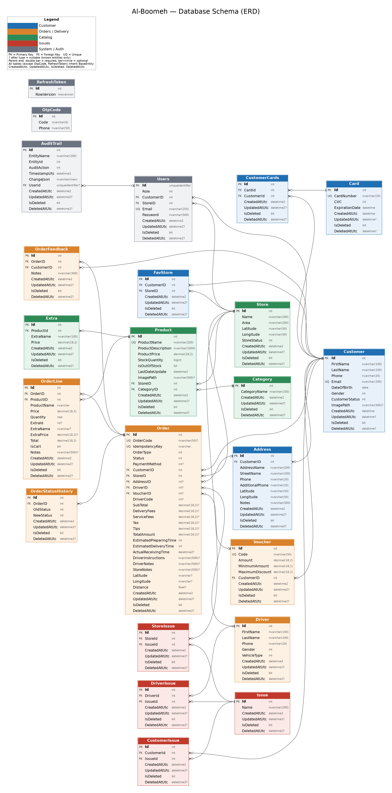

# Al-Boomeh — Design Decisions & Performance Notes

## Database Schema (ERD)



## Design Decisions

- Used **SQL Server** as the relational database.
- Used **foreign keys** to enforce relationships between entities.
- Added a **unique index on `OrderCode`** to guarantee database-level uniqueness.
- Used **soft delete** for entities that should not be physically removed.
- Used a **RESTful API** to design the API.

### Key Indexes

| Index | Purpose |
|---|---|
| `IX_Addresses_CustomerId` | Get addresses by customer ID |
| `IX_Order_CustomerID` | Get orders by customer |
| `IX_Users_CustomerID` | Get the user by customer |
| `IX_Users_Email` | Get the user by email |

## Hardest Problem

The hardest part was **data seeding and auditing**.

- **Seeding:** the hardest part was improving performance. Using `SqlBulkCopy` was something new for me.
- **Audit:** this was also something new, and it was fixed after many attempts.

## One Thing I Would Redo Differently

My worst decision was not structuring and splitting the project properly from the start. It should have been the first thing I did. Doing it early would have made everything that followed easier and saved me a lot of time.

For example, I did not use interfaces from the beginning, and I did not keep the DTOs together in one place.

## Seed Timings

```text
=== Seed Timing Report ===
Categories                        30 rows        164 ms
Stores                            50 rows         16 ms
Customer                      20,000 rows        222 ms
Users                         20,051 rows        249 ms
Product                       40,000 rows        452 ms
Address                       29,977 rows        292 ms
Orders                       300,000 rows     11,434 ms
OrderLines                 1,351,345 rows     25,012 ms
OrderStatusHistory         1,271,242 rows     11,701 ms
```

| Table | Rows | Time |
|---|---:|---:|
| Categories | 30 | 164 ms |
| Stores | 50 | 16 ms |
| Customer | 20,000 | 222 ms |
| Users | 20,051 | 249 ms |
| Product | 40,000 | 452 ms |
| Address | 29,977 | 292 ms |
| Orders | 300,000 | 11,434 ms |
| OrderLines | 1,351,345 | 25,012 ms |
| OrderStatusHistory | 1,271,242 | 11,701 ms |

## Captured SQL

### Product search (products by store)

The product search runs as a single query: filtering (`WHERE`), sorting (`ORDER BY`) and paging (`OFFSET ... FETCH`) all execute inside SQL Server, not in application memory. I know because the captured SQL contains `WHERE [StoreID] = @__storeId_0`, `ORDER BY [p].[ProductName]` and `OFFSET @__p_1 ROWS FETCH NEXT @__p_2 ROWS ONLY`, so only one page of rows leaves the database.
```sql
 SELECT [t].[Id], [t].[ProductName], [t].[StockQuantity], [t].[ProductPrice], [t].[ProductDescription], [t].[IsOutOfStock], [t].[LastDateUpdate], [t].[StoreID], [t].[ImagePath], [t].[CategoryID], [t].[CreatedAtUtc], [t0].[ProductId], [t0].[Id], [t0].[CreatedAt], [t0].[ExtraName], [t0].[Price], [t0].[IsMandatory]
      FROM (
          SELECT [p].[Id], [p].[ProductName], [p].[StockQuantity], [p].[ProductPrice], [p].[ProductDescription], [p].[IsOutOfStock], [p].[LastDateUpdate], [p].[StoreID], [p].[ImagePath], [p].[CategoryID], [p].[CreatedAtUtc]
          FROM [Product] AS [p]
          WHERE [p].[IsDeleted] = CAST(0 AS bit) AND [p].[StoreID] = @__storeId_0
          ORDER BY [p].[ProductName]
          OFFSET @__p_1 ROWS FETCH NEXT @__p_2 ROWS ONLY
      ) AS [t]
      LEFT JOIN (
          SELECT [e].[ProductId], [e].[Id], [e].[CreatedAtUtc] AS [CreatedAt], [e].[ExtraName], [e].[Price], [e].[IsMandatory]
          FROM [Extra] AS [e]
          WHERE [e].[IsDeleted] = CAST(0 AS bit)
      ) AS [t0] ON [t].[Id] = [t0].[ProductId]
      ORDER BY [t].[ProductName], [t].[Id]

 ```

### Get product by id (with extras)
```sql

 SELECT [t].[Id], [t].[ProductName], [t].[StockQuantity], [t].[ProductPrice], [t].[ProductDescription], [t].[IsOutOfStock], [t].[LastDateUpdate], [t].[StoreID], [t].[ImagePath], [t].[CategoryID], [t].[CreatedAtUtc], [t0].[ProductId], [t0].[Id], [t0].[CreatedAt], [t0].[ExtraName], [t0].[Price], [t0].[IsMandatory]
      FROM (
          SELECT TOP(1) [p].[Id], [p].[ProductName], [p].[StockQuantity], [p].[ProductPrice], [p].[ProductDescription], [p].[IsOutOfStock], [p].[LastDateUpdate], [p].[StoreID], [p].[ImagePath], [p].[CategoryID], [p].[CreatedAtUtc]
          FROM [Product] AS [p]
          WHERE [p].[IsDeleted] = CAST(0 AS bit) AND [p].[Id] = @__productId_0
      ) AS [t]
      OUTER APPLY (
          SELECT [t].[Id] AS [ProductId], [e].[Id], [e].[CreatedAtUtc] AS [CreatedAt], [e].[ExtraName], [e].[Price], [e].[IsMandatory]
          FROM [Extra] AS [e]
          WHERE [e].[IsDeleted] = CAST(0 AS bit) AND [t].[Id] = [e].[ProductId]
      ) AS [t0]
      ORDER BY [t].[Id]
```

### Dashboard queries

These are the dashboard queries, kept for reference. They are not the product search.

#### Order count
```sql
SELECT COUNT(*)
FROM [Order] AS [o]
WHERE [o].[IsDeleted] = CAST(0 AS bit)
  AND [o].[CreatedAtUtc] >= CONVERT(date, GETUTCDATE())
  AND [o].[CreatedAtUtc] < DATEADD(day, CAST(1.0E0 AS int), GETUTCDATE())
```

`[11:35:53 INF] HTTP GET /api/Orders responded 200 in 423ms`

#### Orders count by status
```sql
SELECT COUNT(*)
FROM [Order] AS [o]
WHERE [o].[IsDeleted] = CAST(0 AS bit)
  AND [o].[Status] = @__Status_0
  AND [o].[StoreID] = @__storeId_1
```

`[11:36:51 INF] HTTP GET /api/Orders/2/get-count-by-status responded 200 in 519ms`

#### Average order value (last month)
```sql
SELECT AVG([o].[TotalAmount])
FROM [Order] AS [o]
WHERE [o].[IsDeleted] = CAST(0 AS bit)
  AND [o].[Status] = 5
  AND [o].[CreatedAtUtc] >= DATEADD(day, CAST(-30.0E0 AS int), GETUTCDATE())
```

`[11:37:44 INF] HTTP GET /api/Orders/avg-order-value-last-month responded 200 in 499ms`

#### Order status history
```sql
SELECT CAST([o].[OldStatus] AS int) AS [OldStatus],
       CAST([o].[NewStatus] AS int) AS [NewStatus]
FROM [OrderStatusHistory] AS [o]
WHERE [o].[IsDeleted] = CAST(0 AS bit)
  AND [o].[OrderID] = @__orderid_0
```

`[11:38:33 INF] HTTP GET /api/Orders/777/orderhistorystatus responded 200 in 401ms`

#### Top 5 products by store
```text
Executed DbCommand (307ms) [Parameters=[@__p_2='5', @__date_0='2026-08-22T08:39:19.5728230Z', @__storeId_1='5'], CommandType='Text', CommandTimeout='30']
```

```sql
SELECT TOP(@__p_2)
       [o].[ProductID] AS [ProductId],
       CAST(COALESCE(SUM([o].[Quantity]), 0.0E0) AS real) AS [Quantity]
FROM [OrderLine] AS [o]
WHERE [o].[IsDeleted] = CAST(0 AS bit)
  AND [o].[OrderID] IN (
      SELECT [o0].[Id]
      FROM [Order] AS [o0]
      WHERE [o0].[IsDeleted] = CAST(0 AS bit)
        AND [o0].[Status] = 5
        AND [o0].[CreatedAtUtc] >= @__date_0
        AND [o0].[StoreID] = @__storeId_1
  )
GROUP BY [o].[ProductID]
ORDER BY CAST(COALESCE(SUM([o].[Quantity]), 0.0E0) AS real) DESC
```

`[11:39:19 INF] HTTP GET /api/Products/5/top-product responded 200 in 443ms`

### Fixes
**Send POST /api/Customers request response:** "status": 400,
  "errors": {
    "Email": [
      "'Email' is not a valid email address."
    ]
  },
