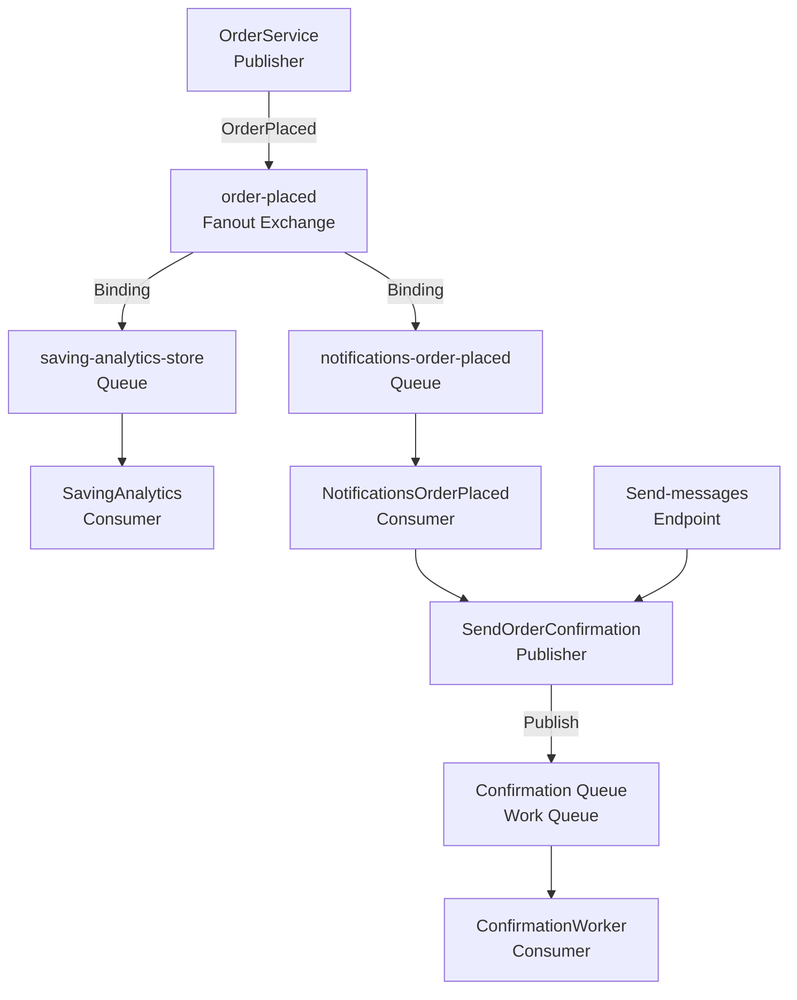

# Hangfire vs RabbitMQ

## Scenario 1

An order is placed. The customer must be notified, analytics must update, and soon loyalty points must be awarded, with more reactions likely later.

This must be an event. The publisher does its job without knowing the consumers, and any consumer can be added at any time to do its own work.

## Scenario 2

Every night at 02:00, generate the per-store sales reports.

This must be a command, because no one else needs to know about it, and it is scheduled for one specific job that runs only once.

## Scenario 3

Send the OTP text right after request-OTP.

Here it should also be a command, but it can also be an event, because there may be another party responsible for calculating the message and the cost that results from it.

## Scenario 4

A separate shipping system, run by another team, must learn whenever an order is delivered.

In this case it must be an event, because there is another party that wants to react to it, and it may need more than one consumer to perform more than one operation.

## Flow Diagram



## The messageId and Version

The version was used because consumers are created before the message is modified. If the shape of the message changes and becomes incompatible with the message the consumer expects, the version tells the consumer which version it is dealing with.

The messageId was used to prevent the save analytics event from being processed twice.

## The Redelivery Story

When the analytics table is updated, a new message record is inserted with a unique messageId. If the insert succeeds, the table update proceeds. If the insert is rejected, it means the message is a duplicate, so the update is refused.

## Fanout vs Work Queue

Fanout: publishes the event to all queues through the exchange, and each consumer receives only from its own queue.

Work queue: publishes all messages to a single queue, and the consumers compete for them in the queue.

## Prefetch

Before using the following line:

```csharp
await _channel.BasicQosAsync(0, 1, global: false, cancellationToken: stoppingToken);
```

the results were completely different. The first version took much longer than the other two versions. After using prefetch 1, the distribution of messages changed: a consumer does not take a message until the one before it has succeeded.

## DLQ Setup

The number of attempts is stored in the message itself, in the x-death header.

`GetFailedAttempts` reads the number of failed attempts. When the number of attempts reaches 3, the message is acked so that it leaves the main queue, and then it goes to the DLQ, outside the consumer, to be processed later.

## The Hardest Thing Today

Of course, the beginning was hard because these are new terms. But the hardest part was poison messages. I did not understand what the term meant, and I thought it was like part-02. After researching it, it turned out to be something completely new. I went back to the primary source first, and then used ChatGPT for examples, advanced explanation, and writing the supporting functions.
