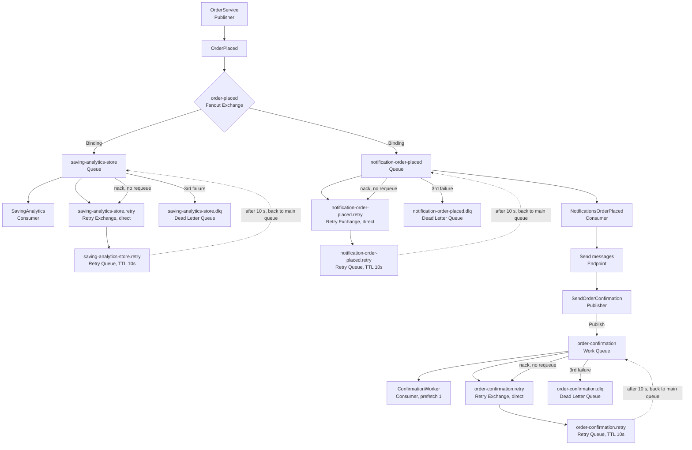

# Hangfire vs RabbitMQ

### Scenario 1: an order is placed

**Choice:** event (`OrderPlaced`, fanout).

**Deciding factor:** the set of reactions is open-ended and owned by other parties.
The publisher announces a fact and does not know who listens. Loyalty points, and later
anything else, are added as new consumers without touching the publisher. If nobody
listens, the order is still placed.

**Why not a command:** a command names one receiver.

### Scenario 2: every night at 02:00, generate the per-store reports

**Choice:** command, scheduled (Hangfire recurring job).

**Deciding factor:** the clock triggers it, not something that happened. There is no
fact to announce, and exactly one known handler. It runs every night; only the
registration happens once.

**Why not an event:** nothing happened for anyone else to react to.

### Scenario 3: send the OTP right after request-OTP

**Choice:** command (`SendOtp`) to one known sender.

**Deciding factor:** the request exists to cause the text. If nobody handles it, the
user never gets the code, which is a failure. In scenario 1, nobody listening is harmless.

**On the message and cost:** working out the message and its cost is part of sending.
If billing needs to know, it reacts to a separate fact published after the send
(`OtpSent`): a command to send, then an event once it is done.

### Scenario 4: a separate shipping system, run by another team, must learn when an order is delivered

**Choice:** event (`OrderDelivered`, published to a fanout exchange).

**Deciding factor:** the consumer belongs to another team. I cannot change its code,
deploy it together with mine, or depend on it being up. So the message is a contract
between two teams: it carries a name (`OrderDelivered`), a version, and a body that
the other team can rely on. 

**It also holds if they are down:** the order is delivered either way. The status change
must not fail or wait because the shipping system is slow. The message waits in their queue.

**Why not a command :** a command names one receiver I control. Calling
their system directly would tie my delivery flow to their availability and API.

## Flow Diagram

## The messageId and Version

The version was used because consumers are created before the message is modified. If the shape of the message changes and becomes incompatible with the message the consumer expects, the version tells the consumer which version it is dealing with.

The messageId was used to prevent the save analytics event from being processed twice.

## Part 2 experiment: forced redelivery

In the analytics consumer, on the first delivery only, I threw an exception after
`UpdateAnalytic` succeeded and before the ack. The work was saved, but RabbitMQ never
heard about it, so it delivered the same message again. Every order was 7.80 at store 1.

### Before the fix (no ProcessedMessage protection)

Order 300043 (numbers read from the SQL UPDATE statements in the log):

| Moment | OrderCount | TotalRevenue |
|---|---|---|
| Before the order | 2 | 15.60 |
| After the first delivery | 3 | 23.40 |
| After the redelivery (inferred from the next order's first UPDATE, 5 / 39.00) | 4 | 31.20 |

One order of 7.80 was counted twice.

### After the fix

Order 300041:

| Time | What happened |
|---|---|
| 05:15:32 | First delivery: ProcessedMessages row saved, Analytics row inserted (1 / 7.80), then the forced exception ("attempt 1/3") |
| 05:15:42 | Redelivery 10 s later: the insert into ProcessedMessages is refused by the unique index (SQL error 2601) |
| 05:15:43 | Log: "Message … was already processed. Skipping it." The message is acked |

No UPDATE on Analytics ran during the redelivery. The next order's UPDATE wrote
2 / 15.60, so the tally was exactly 1 / 7.80 after the redelivery.
## Fanout vs Work Queue

Fanout: publishes the event to all queues through the exchange, and each consumer receives only from its own queue.

Work queue: publishes all messages to a single queue, and the consumers compete for them in the queue.
## Prefetch experiment

30 messages sent to `order-confirmation`, three app instances (ports 7027, 5101, 5102).
Every third message is slow (3 s), the rest take 200 ms (34 s of total work,
so 11.3 s is the ideal time on 3 workers).

| Setting | Total time | Messages per instance |
|---|---|---|
| No prefetch | 30 s | 10 / 10 / 10 |
| Prefetch 1 | 13 s | 11 / 10 / 9 |

Without prefetch, RabbitMQ pushed the messages round-robin up front. All 10 slow
messages  landed on instance 7027, which worked for 30 s
straight while the other two finished at 04:56:14 and sat idle for about 28 s.
With prefetch 1 a worker gets a new message only after acking the previous one,
so the idle workers took more messages and the total dropped to 13 s, close to
the 11.3 s ideal.

## What we gave up: ordering

With competing consumers, messages are delivered in order but finish out of order.
In the prefetch-1 run, seq=2, 5 and 6 finished at 04:44:58, while seq=1 finished at
04:45:01. Any consumer that needs strict order cannot use this pattern.

## DLQ Setup

The number of attempts is stored in the message itself, in the x-death header.

`GetFailedAttempts` reads the number of failed attempts. When the number of attempts reaches 3, the message is acked so that it leaves the main queue, and then it goes to the DLQ, outside the consumer, to be processed later.

## The Hardest Thing Today

Of course, the beginning was hard because these are new terms. But the hardest part was poison messages. I did not understand what the term meant, and I thought it was like part-02. After researching it, it turned out to be something completely new. I went back to the primary source first, and then used ChatGPT for examples, advanced explanation, and writing the supporting functions.

## The Decision:
I decided to record the MessageId before sending the notification.

If the application crashes between these two operations, we risk losing the notification because, after restarting, the application will not resend it, as it is already recorded as processed in the ProcessedMessages table.

However, if we choose the opposite approach, the notification might be sent multiple times without being recorded in ProcessedMessages. This could result in additional costs if an external service provider is involved, as well as making it impossible to track the notification properly.

## The dead-letter queue at 3 a.m.

A message in `notification-order-placed.dlq` failed three times and was parked.

1. **Find it.** Management UI, Queues, `notification-order-placed.dlq`: Ready is the
   number of dead messages. Alert on Ready > 0.
2. **Read why.** "Get messages" with ack mode "Nack message requeue true" (reading does
   not delete). Headers: `x-last-error` (the reason), `x-failed-attempts`. Properties:
   `message_id`. Payload: the order. Check the order exists in the database.
3. **Decide.** Can this message ever succeed?
   - Bad data (the order does not exist): never. Note the message id, purge it.
   - Temporary cause (database or SMTP was down) or a bug now fixed: confirm the cause
     is gone, then move the message back to `notification-order-placed` (shovel plugin).
4. **Before replaying:** the consumer records the message id before it notifies. If a
   row (message_id, 'notifications') survived the failure, the replay would be skipped
   as already processed. Delete that row first:` DELETE FROM ProcessedMessages WHERE MessageId = '...' AND Consumer = 'notificationsّ`
5. Verify the DLQ is empty and the notification arrived.
